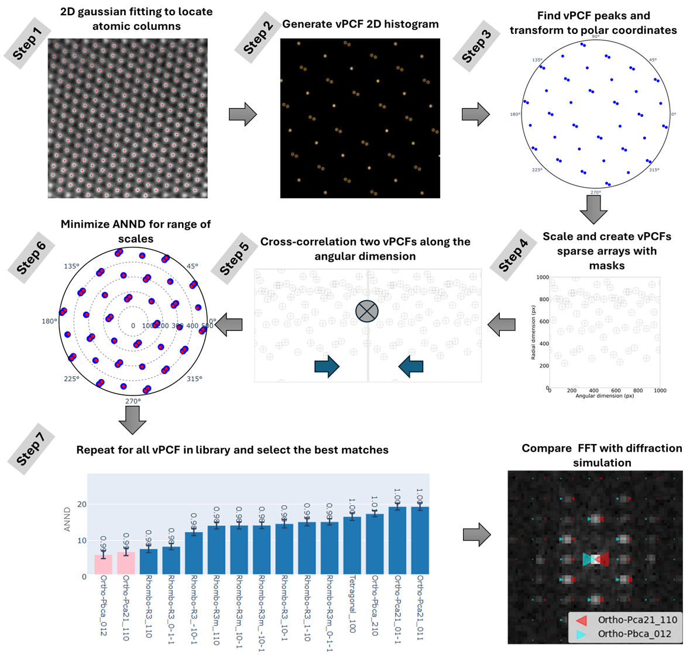

# vpcffit
**A python library for phase-and-orentation mapping of atomic resolution STEM images.**

This library enables the identification of material phases and orientations from atomic resolution STEM images, and is especially useful for materials systems (such as HfO) where many similar may be expected to be present. A **V**ector **P**air **C**orrelation **F**unction (vPCF) is generated from the image and is then compared with a library of known vPCFs, which may be generated from simulated images or directly from `.cif` files. Best matching phases and orientations can be ranked, uncertainties quantified, and ambiguities highlighted. This method is complementary to similar library matching techniques based on image frequencies (Fourier transforms).

## What is in this repository?

+ `vpcffit` is the core python code, split into two files: `vpcffit.py` contains the main fitting algorithm, and `utils.py` contains a variety of helpful utility functions.
+ `tutorials` contains two Jupyter notebooks intended to demonstrate the use of this technique: `Nanoscale phase identification_vPCFs.ipynb` demonstrates the methods for generating a library of vPCFs for the example material system HfO, including how to save the generated vPCFs, as well as some of the general theory ebhind the approach; `Experimental_vPCF_fitting.ipynb` then goes on to show how the generated library can be used to identify the phases present in an example experimental image.
+ The `cif`, `simulation`, and `saved_vpcfs` folders contain data related to the example material system HfO, respectively: several `.cif` files for the different pahses of HfO, simulated STEM images from which a library of vPCFs can be generated, and the saved vPCFs for the system, generated by two different techniques (directly from `.cif` files and from the simulated STEM images).